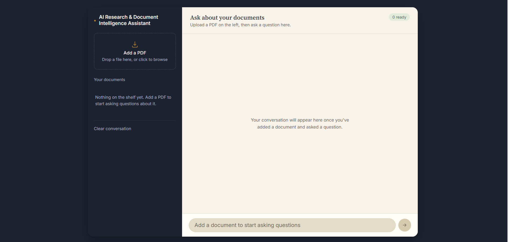

# AI Research & Document Intelligence Assistant

An intelligent document question-answering assistant that allows users to upload PDF documents and ask questions about their content using **Retrieval-Augmented Generation (RAG)**.

The system combines **LangChain, LangGraph, Google Gemini, ChromaDB, Hugging Face embeddings, and FastAPI** to process documents, retrieve relevant information, and generate grounded answers with document and page references.

## Website Preview



---

## 🚀 Features

* 📄 Upload and process PDF documents
* 📚 Support for multiple uploaded documents
* 🔍 Semantic document retrieval using vector embeddings
* 🧠 Retrieval-Augmented Generation (RAG)
* 🤖 Google Gemini-powered answer generation
* 🔗 LangChain-based document processing pipeline
* 🕸️ LangGraph-based answer generation workflow
* 💾 ChromaDB vector database for document embeddings
* 🔤 Hugging Face `all-MiniLM-L6-v2` embeddings
* 💬 Conversational question answering
* 🧾 Document and page-level source references
* ⚡ FastAPI backend
* 🎨 Responsive custom frontend using HTML, CSS, and JavaScript
* 🔐 Environment-variable based API key configuration

---

## 🏗️ System Architecture

The application follows a document intelligence pipeline:

```text
                    ┌─────────────────────┐
                    │      PDF Upload     │
                    └──────────┬──────────┘
                               │
                               ▼
                    ┌─────────────────────┐
                    │    PDF Loading      │
                    │    PyPDFLoader      │
                    └──────────┬──────────┘
                               │
                               ▼
                    ┌─────────────────────┐
                    │   Text Splitting    │
                    │ Recursive Splitter  │
                    └──────────┬──────────┘
                               │
                               ▼
                    ┌─────────────────────┐
                    │     Embeddings      │
                    │ HuggingFace MiniLM  │
                    └──────────┬──────────┘
                               │
                               ▼
                    ┌─────────────────────┐
                    │     ChromaDB        │
                    │   Vector Store      │
                    └──────────┬──────────┘
                               │
                               ▼
                    ┌─────────────────────┐
                    │     Retriever       │
                    │       MMR           │
                    └──────────┬──────────┘
                               │
                               ▼
                    ┌─────────────────────┐
                    │     LangGraph       │
                    │ Answer Generation   │
                    └──────────┬──────────┘
                               │
                               ▼
                    ┌─────────────────────┐
                    │    Google Gemini    │
                    │    Final Answer     │
                    └──────────┬──────────┘
                               │
                               ▼
                    ┌─────────────────────┐
                    │   Answer + Sources  │
                    │   PDF + Page No.    │
                    └─────────────────────┘
```

---

## 🧠 How It Works

### 1. Document Upload

The user uploads one or more PDF documents through the web interface.

The FastAPI backend receives the files and stores them locally.

### 2. PDF Processing

The application uses `PyPDFLoader` to extract text and metadata from the uploaded PDFs.

Each page retains useful metadata such as:

* Source filename
* Page number

### 3. Text Splitting

Extracted document text is divided into smaller chunks using:

```text
RecursiveCharacterTextSplitter
```

Current configuration:

```text
chunk_size = 1000
chunk_overlap = 200
```

This allows the retrieval system to search smaller and more relevant pieces of the documents.

### 4. Embeddings

Each text chunk is converted into a numerical vector using:

```text
sentence-transformers/all-MiniLM-L6-v2
```

These embeddings represent the semantic meaning of the document content.

### 5. Vector Database

The embeddings are stored in:

```text
ChromaDB
```

Each uploaded document receives its own collection.

### 6. Retrieval

When the user asks a question, the system retrieves relevant document chunks using a vector retriever configured with **Maximal Marginal Relevance (MMR)**.

The current retrieval configuration uses:

```text
k = 6
fetch_k = 12
lambda_mult = 0.7
```

### 7. Context Construction

The retrieved chunks are combined into a document context containing:

```text
Source
Page
Content
```

This context is then passed to the answer-generation workflow.

### 8. Answer Generation

LangGraph manages the answer-generation workflow.

Google Gemini receives:

* User question
* Retrieved document context

The model is instructed to answer using the provided document context rather than relying on outside information.

### 9. Source References

The API returns the source documents and page numbers used during retrieval.

Example:

```text
📄 Week 1 Introduction to ML.pdf · Page 6
📄 DS.pdf · Page 2
```

---

## 🛠️ Tech Stack

### Backend

* Python
* FastAPI
* Uvicorn

### AI / Machine Learning

* LangChain
* LangGraph
* Google Gemini
* Hugging Face Sentence Transformers
* Retrieval-Augmented Generation (RAG)

### Vector Database

* ChromaDB

### Document Processing

* PyPDF
* PyPDFLoader
* Recursive Character Text Splitter

### Frontend

* HTML5
* CSS3
* JavaScript

### Development Tools

* Git
* GitHub
* Python Virtual Environment

---

## 📁 Project Structure

```text
ai-research-document-intelligence-assistant/
│
├── app/
│   ├── __init__.py
│   ├── main.py
│   ├── api.py
│   ├── prompts.py
│   ├── chains.py
│   ├── loaders.py
│   ├── embeddings.py
│   ├── vectorstore.py
│   ├── retriever.py
│   ├── rag.py
│   ├── chat_history.py
│   ├── tools.py
│   ├── agent.py
│   ├── graph.py
│   ├── splitter.py
│   └── text_splitter.py
│
├── frontend/
│   ├── HTML/
│   │   └── index.html
│   │
│   ├── CSS/
│   │   └── style.css
│   │
│   └── JS/
│       └── script.js
│
├── data/
│   ├── documents/
│   └── chroma_db/
│
├── tests/
│   ├── __init__.py
│   ├── test_chains.py
│   └── test_retriever.py
│
├── .env
├── .env.example
├── .gitignore
├── requirements.txt
├── README.md
└── run.py
```

---

## ⚙️ Installation

### 1. Clone the repository

```bash
git clone https://github.com/helana-mmagdyy/ai-research-document-intelligence-assistant.git
```

Move into the project directory:

```bash
cd ai-research-document-intelligence-assistant
```

---

### 2. Create a virtual environment

For Windows:

```powershell
python -m venv venv
```

Activate it:

```powershell
venv\Scripts\activate
```

---

### 3. Install dependencies

```powershell
pip install -r requirements.txt
```

---

## 🔐 Environment Variables

Create a `.env` file in the project root:

```env
GOOGLE_API_KEY=your_google_gemini_api_key
```

**Never commit your real API key to GitHub.**

The `.env` file should be included in `.gitignore`.

---

## ▶️ Running the Application

### Start the FastAPI backend

From the project root:

```powershell
python run.py
```

The backend will run at:

```text
http://127.0.0.1:8000
```

You can also access the API documentation at:

```text
http://127.0.0.1:8000/docs
```

---

### Start the Frontend

Open another terminal and run:

```powershell
python -m http.server 5500 --directory frontend
```

Then open:

```text
http://127.0.0.1:5500/HTML/index.html
```

---

## 🔌 API Endpoints

### Upload a PDF

```http
POST /upload
```

Uploads and processes a PDF document.

Example response:

```json
{
  "message": "PDF uploaded successfully.",
  "document_id": "document-id",
  "filename": "document.pdf",
  "pages": 10,
  "chunks": 12,
  "status": "ready"
}
```

---

### Ask a Question

```http
POST /chat
```

Example request:

```json
{
  "question": "What is machine learning?",
  "history": []
}
```

Example response:

```json
{
  "answer": "Machine learning is...",
  "sources": [
    {
      "filename": "Week 1 Introduction to ML.pdf",
      "page": 4
    }
  ]
}
```

---

### Get Uploaded Documents

```http
GET /documents
```

Returns the documents currently registered by the application.

---

### Delete a Document

```http
DELETE /documents/{document_id}
```

Removes a document from the active document list and deletes its uploaded PDF file.

---

## 💬 Example Questions

After uploading documents, users can ask questions such as:

```text
What is machine learning?

What is data science?

What is the learning process?

What are the applications of machine learning?

What is the difference between structured and unstructured data?

Explain the concept discussed on page 6.

Summarize the main ideas from the document.
```

---

## 📸 Application Preview

> Add a screenshot of the application interface here.

Example:

```markdown

```

Recommended screenshot:

* Document shelf on the left
* Uploaded PDF names
* Chat conversation
* Answer
* Source/page references

---

## 🔐 Security Considerations

API credentials are managed through environment variables.

The following files and directories should **not** be committed:

```text
.env
venv/
__pycache__/
data/chroma_db/
```

The real Google API key should never be placed directly inside Python or JavaScript source code.

---

## 🧪 Testing

The project includes a testing directory:

```text
tests/
├── test_chains.py
└── test_retriever.py
```

Tests can be executed using:

```powershell
pytest
```

---

## 📈 Current Capabilities

The current version supports:

* PDF document ingestion
* Multiple document uploads
* Text extraction
* Recursive text chunking
* Semantic embeddings
* Vector storage
* MMR-based retrieval
* Context-aware answer generation
* Conversational question handling
* Source and page references
* Document management
* FastAPI REST endpoints
* Web-based user interface

---

## 🚧 Future Improvements

Possible future improvements include:

* [ ] Streaming AI responses
* [ ] Better document-level retrieval ranking
* [ ] Hybrid keyword + semantic search
* [ ] Reranking retrieved documents
* [ ] Persistent conversation sessions
* [ ] User authentication
* [ ] Cloud deployment
* [ ] PostgreSQL integration
* [ ] Production-ready vector database
* [ ] OCR support for scanned PDFs
* [ ] Support for additional document formats
* [ ] Advanced agentic workflows
* [ ] LangGraph retrieval and tool orchestration
* [ ] Evaluation of RAG retrieval and answer quality

---

## 🎯 Learning Goals

This project was developed as a hands-on learning project to understand and apply:

* LangChain fundamentals
* Prompt templates
* LLM chains
* Document loaders
* Text splitting
* Embeddings
* Vector databases
* Retrievers
* RAG architecture
* Conversational retrieval
* LangGraph workflows
* AI agents and tools
* FastAPI integration
* Frontend-to-backend AI application development

---

## 👩‍💻 Author

**Helana Magdy Lamei**

Computer Science Graduate | AI Engineer

Interested in:

* Artificial Intelligence
* Machine Learning
* Deep Learning
* Natural Language Processing
* Generative AI
* RAG Systems
* Agentic AI
* AI Engineering

### Connect

* GitHub: https://github.com/helana-mmagdyy
* LinkedIn: https://www.linkedin.com/in/helana-magdy-6b517a253/

---

## ⭐ Project

If you find this project useful or interesting, feel free to ⭐ the repository.
